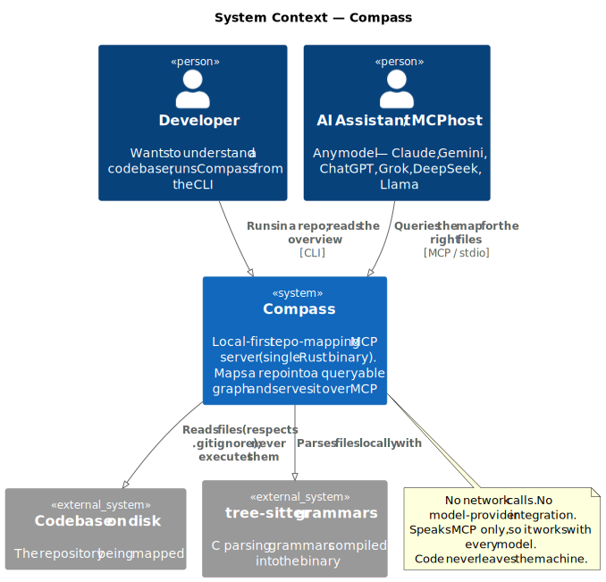
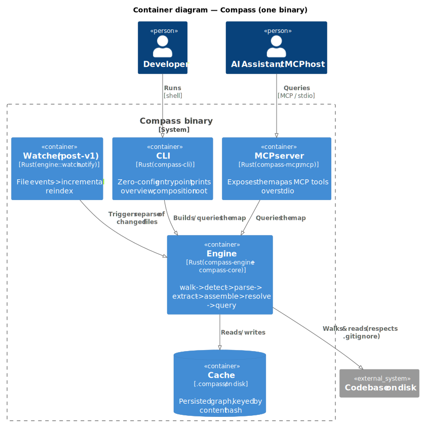
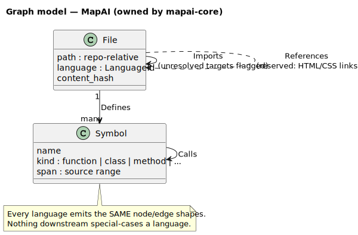
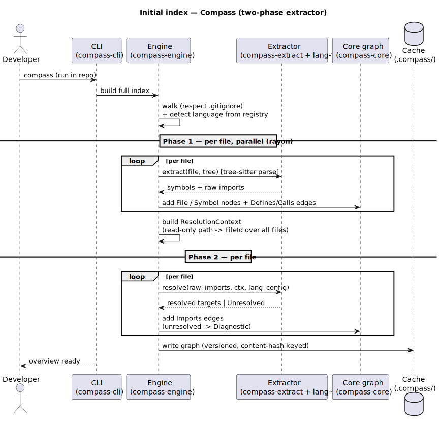
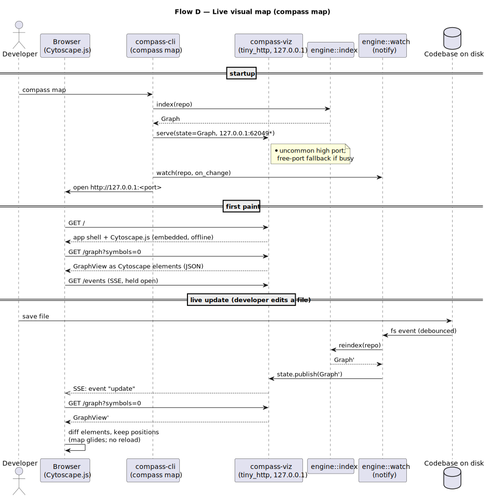

# Architecture — Compass

> Living document. Update it (and add an ADR) when the build changes the design.
> Complexity tier: **serious system** (open-source tool, long-lived, contributor-facing,
> with a hard performance/portability bar).
> Decisions: [ADR-0001 (Rust)](decisions/0001-implementation-language-rust.md) ·
> [ADR-0002 (extractor architecture)](decisions/0002-pluggable-language-extractor-architecture.md) ·
> [ADR-0003 (explicit registry)](decisions/0003-extractor-registration-explicit-registry.md) ·
> [ADR-0004 (serde & cache format)](decisions/0004-serde-placement-and-cache-format-versioning.md) ·
> [ADR-0005 (visualization & local server)](decisions/0005-visualization-subsystem-and-local-server.md) ·
> [ADR-0006 (context pre-injection)](decisions/0006-context-pre-injection.md)
>
> Structure validated by an independent architect review (2026-06-17); the refinements it
> produced are incorporated here. The visualization subsystem (`compass-viz`, the `compass map`
> command, and the new graph queries) was added 2026-06-18 per ADR-0005. Context pre-injection
> (`compass context` + a host hook; the benchmark-driven default delivery, with MCP kept for
> deepening) was added 2026-06-19 per ADR-0006.

## 1. Overview & chosen stack

Compass walks a repository, parses each file locally with tree-sitter, extracts symbols and
imports, assembles a **language-agnostic graph**, and serves that graph to humans (CLI) and
to AI assistants (an MCP server over stdio). Live freshness keeps the map current as you
edit, via `compass watch` (FR-13/F1).

The system is a **Cargo workspace** with **five infrastructure crates** plus **one
feature-gated crate per language** behind one stable `Extractor` trait (the North Star,
ADR-0002). The core graph and the MCP layer never know about any specific language; the one
place that names languages is the CLI composition root.

| Layer | Choice | ADR |
|-------|--------|-----|
| Language / runtime | Rust (single static binary) | [ADR-0001](decisions/0001-implementation-language-rust.md) |
| Parsing engine | tree-sitter (C core + per-language grammars, statically linked) | [ADR-0001](decisions/0001-implementation-language-rust.md) |
| Extensibility model | `Extractor` trait + one crate per language | [ADR-0002](decisions/0002-pluggable-language-extractor-architecture.md) |
| Language registration | Explicit `cfg`-gated `register_all()` in the CLI (no linker magic) | [ADR-0003](decisions/0003-extractor-registration-explicit-registry.md) |
| Repo walk | `ignore` crate (ripgrep's gitignore-respecting parallel walker) | — |
| Parallelism | `rayon` (GIL-free multi-core parse) | [ADR-0001](decisions/0001-implementation-language-rust.md) |
| AI interface | MCP via `rmcp` (official Rust SDK), stdio transport | — |
| Visualization | interactive force-directed map in the browser; `compass-viz` serves it on `127.0.0.1` over a tiny HTTP+SSE server (`tiny_http`), renderer is **Cytoscape.js** (MIT, vendored offline) | [ADR-0005](decisions/0005-visualization-subsystem-and-local-server.md) |
| Serialization / cache | `serde` on core types; versioned on-disk format under `.compass/` | [ADR-0004](decisions/0004-serde-placement-and-cache-format-versioning.md) |
| Datastore | in-memory graph + on-disk cache (no database) | — |
| Errors | `thiserror` (libraries) / `anyhow` (binary boundary) | — |
| Tests | per-language fixtures + snapshot tests (`insta`), inside each language crate | — |

## 2. System context (C4 level 1)



Compass sits between a **codebase on disk** and the people/tools that need to understand it.
A **developer** runs it from the CLI to see an overview; an **AI assistant** (any
MCP-capable host — Claude, Gemini, ChatGPT, etc.) connects to Compass's MCP server to query
the map. Compass reads the repository (respecting `.gitignore`) and uses the **tree-sitter**
grammars compiled into it. It makes **no network calls** and talks to **no model
provider** — it only speaks MCP, so it works with every model (FR-5/C2, FR-7/G1).

## 3. Containers (C4 level 2)



Compass ships as **one binary** with four entry modes around a shared engine:

- **CLI** (`compass`) — zero-config command run inside a repo; prints the human overview and
  can launch the server. It is also the **composition root** (it decides which language
  crates are compiled in and registers them).
- **MCP server** — long-running process (stdio) that an AI host launches and queries.
- **Watcher** *(FR-13/F1)* — `compass watch`: turns file-system events into map updates (v1
  re-indexes on change; incremental single-file reparse is a planned optimization).
- **Map server** *(FR-20/FR-21, ADR-0005)* — `compass map`: serves an interactive,
  force-directed **visual map** to the browser over a localhost HTTP server, and pushes live
  updates over SSE off the watcher, so the open page re-lays-out as you edit. Opt-in,
  `127.0.0.1`-only, read-only, alive only while the command runs.

All modes drive the same in-process **engine** (walk → detect → parse → extract → assemble
→ resolve → query) and read/write the same on-disk **cache** under `.compass/`. The visual map
and the AI both read the **same graph** through the `compass-core` query port — one source of
truth, two views (a picture for the human, cheap structured queries for the AI).

## 4. Components & boundaries

Each component is a crate in the workspace. Dependencies point **inward** toward
`compass-core`. Only the CLI composition root depends on language crates (gated by cargo
features); core, engine, and mcp never do.

| Component (crate) | Responsibility (one line) | Talks to |
|-------------------|---------------------------|----------|
| `compass-core` | Language-agnostic domain: graph model, `File`/`Symbol`/edge types, `LanguageId`, cross-crate `Diagnostic`, query engine + a query **port** trait (`overview`, `file_dependencies`, `broken_imports`; `graph_view`, `subgraph`, `shortest_path` per ADR-0005; `context` per ADR-0006). Owns the serde-serialized form (versioned). | (depended on by everything) |
| `compass-extract` | The **stable contract**: the `Extractor` trait (two phases — `extract` + `resolve`), the tree-sitter parse harness, `RawImport`, `RawCall`, `ResolutionContext`, `Detection { extensions, shebangs }`, an opaque `LangConfig` carrier, the unresolved/extractor error variant, and the `Registry` + `register` entry point | `compass-core` |
| `compass-engine` | Orchestrate full/incremental indexing. Internal modules: `walk` (gitignore-aware walk + registry-driven detection), `index` (rayon parse+extract, builds the `ResolutionContext`, calls `Extractor::resolve`, assembles the graph), `cache` (`.compass/` persistence), `watch` (live re-mapping, FR-13); `config` (`.compass.toml`) is planned. | `compass-core`, `compass-extract` |
| `compass-mcp` | Expose query operations as MCP tools over stdio (`rmcp`) — `overview`, `file_dependencies`, `broken_imports`, plus `subgraph` and `shortest_path` (ADR-0005); `schemars` DTO wrappers own the wire schema | `compass-core` (query types + query **port**) — **not** the engine |
| `compass-viz` | Serve the interactive force-directed **visual map** to the browser: a `127.0.0.1` HTTP server (`tiny_http`) with SSE live-push, and a self-contained `map.html` snapshot. Vendors **Cytoscape.js** (embedded offline) and owns its render DTOs (Cytoscape element JSON). Like `compass-mcp`, depends on `compass-core`'s query **port** — **not** the engine (ADR-0005) | `compass-core` (query **port**) |
| `compass-cli` | Binary entrypoint `compass`; arg parsing; **composition root**: explicit `cfg`-gated `register_all()`, wires the concrete engine into the MCP **and** viz query ports, drives `compass map` (start viz server + watch loop, publish live updates), and renders `compass context` for prompt pre-injection (ADR-0006) | everything above + the language crates (feature-gated) |
| `compass-lang-*` | One crate per language: `Detection`, grammar, symbol extraction, **and** that language's import-resolution algorithm; ships its own fixtures + snapshot tests | `compass-extract`, `compass-core` |
| `compass-lang-template` | Copy-paste skeleton for a new language; **excluded** from the workspace so it never links or gates CI | (template only) |

**Why the seams are here.** The durable boundary is `compass-extract` — the contract between
the language-agnostic world (`core`, `engine`, `mcp`, `cli`) and the language-specific world
(`lang-*`). The compiler (not code review) enforces that a `lang-*` crate can only reach
`compass-extract` + `compass-core`. `compass-core` stays a **pure domain model** — no MCP, no
tree-sitter, no language, no walk/notify/rayon, no HTTP/viz — because it is the universal
dependency sink that everything else serializes and queries. `compass-viz` is a **second
protocol surface** alongside `compass-mcp`: both consume the core query port and nothing else
(the compiler enforces it), so the browser view and the AI view can evolve independently and
neither can reach into the engine. `compass-core` and `compass-extract` are kept
separate on purpose: the core model churns while the trait must stay frozen, so they have
different change cadences. `walk`/`index`/`cache` are single-consumer plumbing and live as
**modules** inside `compass-engine`; a module earns its own crate only on a documented trigger
(a second consumer, an independent release cadence, or a real compile-gate need).

## 5. Data model



The map is a directed graph held in memory (and cached on disk). All languages emit the
**same shapes** (DoD §4) — no downstream special-casing. The domain types and their `serde`
form live in `compass-core` (ADR-0004).

| Entity | Owned by | Stored in | Notes |
|--------|----------|-----------|-------|
| `File` node | `compass-core` | in-memory graph + `.compass/` cache | path (repo-relative), `LanguageId`, content hash (for incremental staleness) |
| `Symbol` node | `compass-core` | same | name, kind (function/class/method/…), defining file, source span |
| `Imports` edge | `compass-core` | same | File → File, produced by the `resolve` phase; unresolved targets become `Diagnostic`s (FR-12/D2) |
| `Defines` edge | `compass-core` | same | File → Symbol |
| `Calls` edge | `compass-core` | same | Symbol → Symbol; resolved by the engine from each extractor's raw calls (same-file match, else a unique global one; ambiguous skipped). Emitted by the Rust extractor today; other languages opt in per crate |
| `References` edge | `compass-core` | same | File → File; reserved for HTML/CSS link/asset edges (FR-19/H4) |
| `Diagnostic` | `compass-core` | in-memory + surfaced via MCP | non-fatal per-file issues: parse errors, unresolved imports — the universal sink |

**Consistency:** single-process, single-writer; the graph is rebuilt atomically on full
index and patched per-file on incremental update. The disk cache is keyed by content hash
and tagged with a **cache-format version** (ADR-0004) — a stale or mismatched cache triggers
a clean reindex, never a blind trust.

**Query results are derived, not stored.** `Overview`, `FileDependencies`, (ADR-0005)
`GraphView` (all nodes/edges for rendering, files-only or files+symbols), `Subgraph` (the
neighborhood around a file), the `shortest_path` result, and (ADR-0006) the `ContextPack`
(the token-bounded slice pre-injected into a prompt) are **computed on demand** from the
graph above — they add no new persisted entity and no new edge type. The visual map is just a
`GraphView` rendered in the browser; the AI's cheap fetch is a `Subgraph` over the same data.
Each `GraphView` file node also carries a **community `group` id** and an **`is_hub` flag** from a
deterministic clustering pass (label propagation over the import graph) — see ADR-0005; this lets
the UI color "sub-parts of the project" structurally rather than by folder, and is recomputed per
`graph_view` call, never persisted.

## 6. Key flows

**Flow A — Initial index (the performance-critical path).**



The two-phase extractor is the key detail: per-file `extract` runs in parallel; whole-repo
`resolve` runs after the file inventory exists, but the resolution *algorithm* is the
language crate's, called through the trait — no per-language logic lands in the engine.

```
compass-cli → compass-engine::index
  → engine::walk (ignore: parallel, .gitignore-aware; language detection from the registry)
  → PHASE 1 — per file, parallel (rayon):
        compass-extract parses with tree-sitter
        → Extractor::extract(file, tree) → { symbols, raw_imports, raw_calls }
        → assemble File/Symbol nodes + Defines edges into compass-core
  → resolve raw_calls → Calls edges (Symbol → Symbol): same-file name match first, else a
        unique global match; ambiguous names are skipped (no guessed edge). Language-agnostic.
  → engine builds a ResolutionContext (read-only path→FileId over all File nodes)
  → PHASE 2 — per file:
        Extractor::resolve(raw_imports, &ResolutionContext, &lang_config)
        → resolved Imports edges; unresolved → Diagnostic (FR-12/D2)
  → engine::cache writes .compass/ (versioned)
```

**Flow B — AI query over MCP.** AI host → `compass-mcp` (stdio tool call, e.g. *get subgraph
for file X*) → the query **port** implemented by `compass-core` → returns a small, relevant
subgraph (FR-11/C3) of **only real, mapped files** (FR-6/D1). The CLI wires the concrete
engine/graph into the port at startup, so `compass-mcp` stays engine-agnostic.

**Flow C — Live freshness (FR-13/F1).** `compass watch` runs `engine::watch`: a debounced,
gitignore/cache-aware file watcher (`notify`). On change it re-indexes the repo and refreshes
the cache. *Planned optimization:* reparse only the changed file and patch the affected
nodes/edges, so steady-state cost is one file, not the repo.

**Flow D — Live visual map (FR-20/FR-21, ADR-0005).**



`compass map` is the composition root wiring the viz surface to the watcher:

```
compass-cli map
  → engine::index → Graph                       (initial map)
  → compass-viz::serve(state, 127.0.0.1:<port>)  in a background thread
        GET /            → app shell (HTML/CSS/JS + Cytoscape.js, embedded offline)
        GET /graph?symbols=0|1 → GraphView as Cytoscape elements (JSON)
        GET /events      → SSE stream (held open per browser tab)
  → open http://127.0.0.1:<port> in the browser  (auto; --no-open to skip)
  → engine::watch(repo, debounce, on_change):
        on_change → engine::index → Graph' → state.publish(Graph')
                  → SSE `update` event to every open tab
                  → browser refetches /graph and Cytoscape diffs the elements
                    (adds/removes nodes, keeps positions) → the map glides, no reload
```

The port defaults to an **uncommon high port (`62049`)** to avoid the user's other services and
containers, and **falls back to an OS-assigned free port** if it is busy; the exact
`http://127.0.0.1:<port>` URL is always printed (and opened). `compass map --snapshot` instead
writes a single self-contained `.compass/map.html` (app + data inlined) and exits — an offline,
serverless picture. The viz server reuses `engine::watch`; `compass-viz` itself never depends on
the engine (the CLI mediates), preserving the §4 layering.

## 7. NFR strategy

| Attribute (from requirements) | How the design achieves it |
|-------------------------------|----------------------------|
| Performance @ scale | `ignore` parallel walk + `rayon` parallel `extract` (no GIL); per-file work is independent; `resolve` is a second pass over an in-memory inventory; content-hash cache skips unchanged files on restart |
| Startup | Native binary, no runtime warmup; cache load avoids re-indexing on every launch |
| Privacy (G1) | No networking code in the binary at all; tree-sitter parses locally; code is never executed, only read; no telemetry |
| Correctness / robustness (D1/D2) | Per-file parse errors and unresolved imports become `Diagnostic`s, never fatal — one bad file never aborts the index; graph holds only real files |
| Maintainability / extensibility (H1) | `Extractor` trait + per-language crates + explicit registration; core/engine/mcp are language-agnostic; per-language fixtures guard against cross-language regressions |
| Portability (A2) | Single static binary per target; grammars statically linked (no runtime C dep); CI release matrix per OS/arch (see §10 — the musl/aarch64 C toolchain is the real cost) |
| Visual map, offline (FR-20/FR-21) | Cytoscape.js + the app HTML/CSS/JS are **vendored and embedded** in the binary (`include_str!`), so the map renders with **no CDN and no internet**; the server is loopback-only, so it works on an air-gapped machine. Live updates ride the existing watcher (no polling cost) |

### Threat model (right-sized — local, read-only tool)

Trust boundary: Compass runs with the user's privileges and ingests **untrusted repository
content**. Surface is small but not zero:

- **Path traversal / scope escape** → constrain all file access to the repo root; never
  follow symlinks out of the tree; the map only ever references in-repo paths.
- **Malicious/pathological input causing DoS** (huge or adversarial files) → cap per-file
  size and parse time; tree-sitter is designed for hostile input, and a failed parse is
  contained to that file (becomes a `Diagnostic`).
- **Information disclosure** → there is no telemetry and no outbound network path; the map stays
  on disk under `.compass/`. The MCP server listens on **stdio only** (no socket). The **viz
  server (`compass map`, ADR-0005)** is the one listener, and a deliberate, scoped exception: it
  binds **`127.0.0.1` only** (no flag exposes it publicly), is **opt-in** (never started by
  `serve`/`overview`/`init`/`watch`), **ephemeral** (dies with the command), and **read-only**
  (GET-only; it serves the already-mapped graph and never mutates the repo). Default port is an
  **uncommon high port with free-port fallback**, so it cannot collide with the user's other
  services or containers. *Residual risk:* another local process/browser tab could reach the port
  (local CSRF); accepted for v1 (read-only, non-secret local map data). *Future hardening:* random
  port + per-session URL token + `Origin`/`Host` check.
- **Code execution** → Compass **never executes** mapped code; it only parses (the viz server
  changes nothing here — it is read-only). This is a core safety property, not an add-on.

## 8. Repository & directory structure

Each top-level folder is dedicated to one part of the tool; per-language logic lives **only**
in that language's crate, alongside its own fixtures and tests.

```
compass/
├── Cargo.toml                       # workspace manifest
│                                    #   [workspace.dependencies]: tree-sitter + every grammar pinned ONCE
│                                    #   members = all crates/* EXCEPT compass-lang-template (in `exclude`)
├── Cargo.lock
├── README.md
├── CONTRIBUTING.md
├── LICENSE-MIT  /  LICENSE-APACHE   # dual license
├── ProjectInfo.md                   # product vision / spec
│
├── docs/
│   └── architecture/
│       ├── 01-requirements.md
│       ├── 02-architecture.md       # (this file)
│       ├── decisions/               # ADRs 0001–0004
│       └── diagrams/                # .puml sources + rendered .svg
│
├── crates/
│   │  ── the durable language seam (DO NOT simplify) ──
│   ├── compass-core/                  # domain ONLY: graph model, File/Symbol/edge types, LanguageId,
│   │                                #   Diagnostic, query engine + query port. serde lives here (versioned form).
│   ├── compass-extract/               # the STABLE contract: Extractor trait (extract + resolve),
│   │                                #   tree-sitter harness, RawImport, ResolutionContext,
│   │                                #   Detection{extensions, shebangs}, LangConfig, Registry + register entry.
│   │                                #   Depends on compass-core ONLY.
│   │
│   │  ── orchestration (walk + index + cache + watch as modules) ──
│   ├── compass-engine/                # engine::walk · engine::index · engine::cache · engine::watch
│   │                                #   (engine::config is planned). Depends on core + extract.
│   │
│   │  ── separable protocol surfaces (browser + AI) ──
│   ├── compass-mcp/                   # MCP server (rmcp) + tool defs; schemars DTOs own the wire schema.
│   │                                #   Depends on compass-core (query port) ONLY — not the engine.
│   ├── compass-viz/                   # Visual map: 127.0.0.1 HTTP+SSE server (tiny_http) + render DTOs.
│   │   └── assets/                  #   vendored Cytoscape.js (MIT) + app HTML/CSS/JS, embedded offline.
│   │                                #   Depends on compass-core (query port) ONLY — not the engine (ADR-0005).
│   │
│   │  ── composition root / binary ──
│   ├── compass-cli/                   # `compass` binary + composition root. Owns the explicit cfg-gated
│   │                                #   register_all() (one feature + one register() call per language);
│   │                                #   wires the concrete engine into the mcp query port.
│   │
│   │  ── language plugins: one crate each (the growth axis) ──
│   ├── compass-lang-go/               # ── Tier 1, BUILT FIRST (walking skeleton) ──
│   │   └── tests/
│   │       ├── fixtures/            # sample Go project (co-located, self-contained)
│   │       └── *.rs                 # insta snapshot tests; `cargo test -p compass-lang-go` compiles ONE grammar
│   ├── compass-lang-python/           # ── Tier 1, post-skeleton; template is extracted from this 2nd extractor ──
│   ├── compass-lang-java/             # ── Tier 1, post-skeleton ──
│   ├── compass-lang-csharp/           # ── Tier 1, post-skeleton ──
│   └── compass-lang-typescript/       # ── Tier 1, post-skeleton (TypeScript + JavaScript) ──
│
├── crates/compass-lang-template/      # EXCLUDED from workspace.members; created AFTER a real extractor exists.
│
├── integrations/
│   └── claude-code/                 # host wiring: the UserPromptSubmit pre-injection hook (ADR-0006)
│
└── tests/
    └── e2e/                         # ONLY the cross-crate smoke test: walk → graph → MCP overview.
                                     #   Per-language fixtures live in each lang crate, NOT here.
```

A new language = a new `crates/compass-lang-<name>/` (with its own fixtures + tests) + an
optional workspace dependency and `lang-<name>` feature in `compass-cli` + one line in
`register_all()`. **No edits to `compass-core`, `compass-engine`, or `compass-mcp`.**

## 9. Cross-cutting decisions

- **Shared-type placement (no grab-bag crate):** `LanguageId` and all node/edge/graph domain
  value types live in `compass-core`; `compass-extract` defines the trait + harness + `RawImport`
  + `ResolutionContext` + `Detection` + `LangConfig` + the registry, and depends on core
  (never the reverse). The cross-crate `Diagnostic` lives in `compass-core`. A
  `compass-common`/`compass-types` dumping-ground crate is forbidden.
- **Config & zero-config:** works with no config; optional `.compass.toml` at repo root
  (owned by `engine::config`) for overrides. `enabled languages` only **filters** the
  compiled-in set — it cannot add a language at runtime (no `.so` loading). Per-language
  project config (tsconfig paths, source roots, `.csproj` refs) is **opaque** to core and
  flows to the language crate via `LangConfig` in the `resolve` phase.
- **Detection is registry-driven** for **both** extensions **and** shebang interpreter
  patterns: each `Extractor` declares `Detection { extensions, shebangs }`; `engine::walk`
  consumes the union and holds no per-language table.
- **MCP tool surface:** shipping today — `overview`, `file_dependencies` (deps + dependents),
  `broken_imports`. Adding per ADR-0005 — `subgraph` (the relevant slice around a file, so the
  AI fetches a small cheap context instead of grepping — FR-11/C3) and `shortest_path` (the
  import path between two files — FR-17/E1). A `supported_languages` tool is planned, derived
  from the **same registry** the engine uses so it cannot drift from reality (FR-14/H2). DTOs
  (`schemars`) own the wire schema in `compass-mcp`.
- **Visualization surface (ADR-0005):** `compass-viz` consumes the same query port — `graph_view`
  for the full picture and `subgraph` for focus mode — and owns its **Cytoscape element JSON** as
  its render schema (the browser analogue of `compass-mcp`'s wire DTOs). It binds `127.0.0.1`
  only, defaults to an uncommon high port with free-port fallback, and is read-only.
- **Node grouping (ADR-0005):** the default coloring is by **detected community** (a deterministic
  label-propagation pass over the import graph, computed in `compass-core`), so the map highlights
  cohesive "sub-parts" regardless of whether the repo is foldered by feature or by type; **folder**
  and **language** are alternate color modes, and hub files (cross-group connectors) render neutral.
- **AI delivery is pre-injection-first (ADR-0006):** the **default** way an agent gets the map is
  `compass context` — a token-bounded slice (summary + most-relevant files, by seed-neighborhood /
  query-term / centrality) **pre-injected into the prompt** via a host hook (e.g. Claude Code
  `UserPromptSubmit`), so the agent reasons instead of exploring (a benchmark showed the tool-loop's
  per-call turn cost cancels its savings — see [`docs/benchmarks/`](../benchmarks/README.md)). The
  **MCP** tools are kept for **on-demand deepening** when the pre-injected slice misses, and as the
  **cross-host portability** path (hooks are per-host; MCP is the one universal protocol — FR-5/C2).
- **Serialization (ADR-0004):** `serde` derives on `compass-core` types; the on-disk form is a
  **versioned** compatibility surface (a version bump triggers a clean reindex).
- **Error handling:** `thiserror` for typed library errors; `anyhow` only at the CLI/server
  boundary. **Never panic on input** — a malformed file yields a `Diagnostic` and the index
  continues.
- **Testing & CI:** per-language fixtures + snapshot assertions live **inside each language
  crate**. CI runs two distinct jobs: **(1) per-crate compile** (`cargo build -p
  compass-lang-<x>`) to prove the grammar builds in isolation; **(2) per-language integration**
  — build `compass-cli` with only that one feature, run the language's fixtures through the
  real registry, and assert `supported_languages` reports exactly that language (this is what
  actually guards registration + FR-14/H2). Plus one cross-crate e2e smoke test.

## 10. Risks & open questions

| Risk / question | Impact | Plan to de-risk |
|-----------------|--------|-----------------|
| **musl/aarch64 release toolchain** — single static binary (A2) needs a real musl C cross-toolchain and native aarch64 runners because grammars are C compiled via `cc`; `rustup target add` alone won't link them | High | Prove the **linux-musl static build on the Go-only binary in the walking skeleton** (release dry-run), so the toolchain reality surfaces on the thin slice, not at release. *(Pending user sign-off on skeleton scope.)* |
| Contributor onboarding friction (Rust + C toolchain) — threatens the North Star | High | `compass-lang-template` (extracted from a real extractor) + CONTRIBUTING walkthrough + feature-gated builds + documented dev env; **validate by adding the 2nd language (Python) via the template and timing it** |
| Import resolution is genuinely per-language and whole-repo | Med | Solved structurally: the two-phase `Extractor` (`extract` then `resolve(&ResolutionContext)`); algorithm stays in `lang-*`. Prove with a **non-relative Go import** in the skeleton (Go alone won't exercise tsconfig-style config — don't over-trust it) |
| In-memory graph size on 100k+ repos | Med | Compact structs + interned strings; **measure on a large real repo early**; cache to disk |
| Registration correctness | Low | Explicit `register_all()` (ADR-0003) removes the LTO/dead-code-elimination failure mode; CI self-test asserts `count(registered) == count(enabled features)` |
| Viz node-count ceiling (ADR-0005) — Cytoscape's canvas renderer slows on very large graphs, worst with the files+symbols toggle on a big repo | Med | Files-only is the default; cluster by folder and lazy-expand symbols on click; cap rendered nodes with a "show more" affordance. Escape hatch if 100k-node repos demand it: swap the renderer for Sigma.js/WebGL behind the same `GraphView` JSON (the server contract is renderer-agnostic) |
| Vendored Cytoscape.js asset drifts / carries a CVE | Low | Pin the exact version, embed it offline, record its MIT notice; bump deliberately like any dependency. No runtime CDN means no third-party fetch at use time |
| Local viz socket as new attack surface (ADR-0005) | Low | Loopback-only, opt-in, ephemeral, read-only (see §7 threat model); residual local-CSRF risk accepted for v1, hardening path documented |
| Walking-skeleton scope | — | Thinnest end-to-end slice: workspace + `core`/`extract`/`engine`/`mcp`/`cli` + **one** language (Go), walk → extract → assemble → resolve (one non-relative import) → graph → one MCP `overview` tool; fmt/clippy/test + e2e smoke; **+ the linux-musl release dry-run** (pending sign-off). Proves every seam before breadth. |
